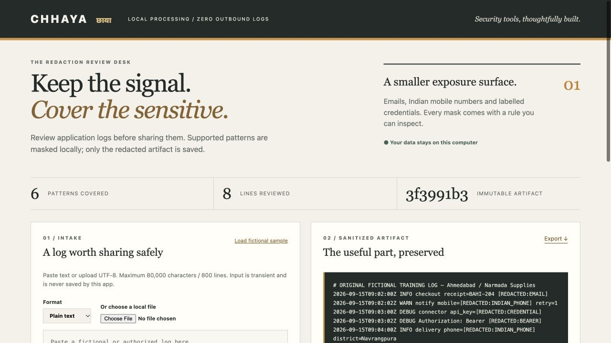
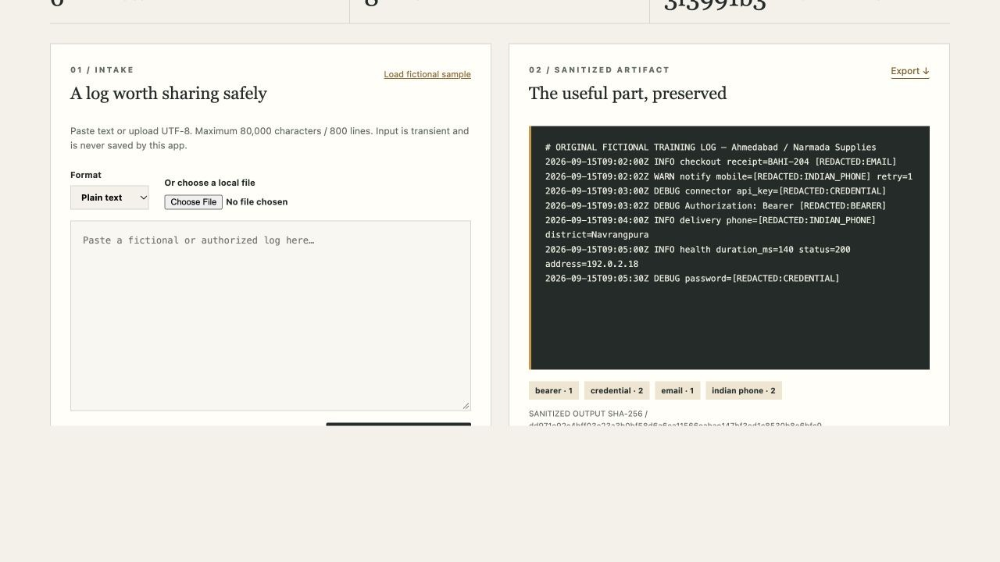
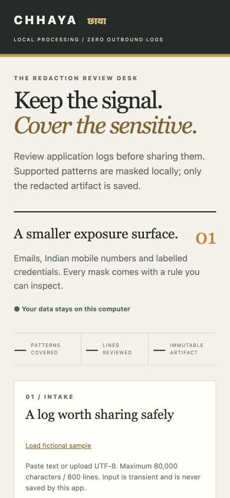
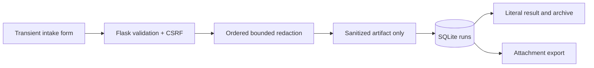

# Chhaya — Log Redaction Gateway

[](https://github.com/Siddh-sys-rgb/chhaya-log-redaction-gateway/actions/workflows/tests.yml)

A local Flask workspace that removes supported sensitive patterns from application logs before they are shared. Paste text or upload JSON Lines, inspect the masked result and export an immutable artifact. The original log is never written to the application database.

The fictional setting is Narmada Supplies in Ahmedabad. Sample people, credentials and log events are authored for this repository. No external dataset or cloud inference service is required.







## What works

- Plain-text and recursive JSONL redaction for supported email addresses, Indian mobile numbers, explicit credential keys, Bearer values and selected token prefixes.
- Quoted values, escaped quotes, long credentials and integer-valued JSON phone numbers are covered by regression tests.
- Per-rule counts and plain-language explanations, redacted-output SHA-256, immutable SQLite artifacts and a history archive.
- Raw text is used transiently by the request, then discarded. The browser clears its intake field after a successful save.
- Safe error responses, CSRF-protected writes, localhost host/origin checks, a unique session cookie, a restrictive CSP and literal DOM rendering.

## Run on macOS or Linux

Python **3.11 or 3.12** is recommended. Node is optional and used only to verify JavaScript syntax.

```bash
git clone https://github.com/Siddh-sys-rgb/chhaya-log-redaction-gateway.git
cd chhaya-log-redaction-gateway
python3 -m venv .venv
source .venv/bin/activate
python -m pip install -r requirements-dev.txt
python app.py --port 8114
```

Open **http://127.0.0.1:8114**. The server binds to localhost and does not enable Flask debug mode. Runtime data lives in the ignored `instance/` directory. `requirements-tested.txt` records the versions used during development; install it instead of the two requirements files if you want that exact dependency set.

## Run on Windows PowerShell

```powershell
git clone https://github.com/Siddh-sys-rgb/chhaya-log-redaction-gateway.git
cd chhaya-log-redaction-gateway
py -3.12 -m venv .venv
.\.venv\Scripts\python.exe -m pip install -r requirements-dev.txt
.\.venv\Scripts\python.exe app.py --port 8114
```

The commands use the virtual environment's executable directly, so activating PowerShell scripts is unnecessary.

## Two-minute demonstration

1. Click **Load fictional sample**. Seven lines of clearly fictional application activity are loaded; nothing is saved yet.
2. Click **Redact & save artifact**. The sample yields **six masks**: one email, two phone numbers, two labelled credentials and one Bearer value.
3. Inspect the result and the rule chips. The receipt ID, timestamp, status and documentation-only IP address remain useful.
4. Click **Export**. The downloaded file contains the saved redacted output, with a generated filename that cannot contain the original upload's name.
5. Reload the page and open the artifact from the archive. Raw input is absent; the output and its digest remain available.
6. For JSONL, select **JSON Lines** and paste `{"phone":9000000001,"password":"fictional","ok":true}`. The sensitive values are replaced while `ok` remains a boolean.

For a separate review database or a fixture-free run:

```bash
python app.py --port 8114 --data-dir instance-review --no-demo
```

`--no-demo` disables the sample endpoint/button; it does not change the detector. Stop the process before changing its data directory. The session key in that directory is created with owner-only permissions on Unix. Do not commit runtime data or session keys.

## Supported formats and scope

| Pattern | Examples | Notes |
|---|---|---|
| Email | `riya.shah@example.test` | Bounded ASCII mailbox/domain shapes; not a full RFC email validator. |
| Indian mobile | `+91 90000 00001`, `90000-00002` | Standalone ten-digit mobile form starting with 6–9; optional 91 prefix and spaces/hyphens. Integer JSON values are checked too. |
| Labelled credential | `password="two words"`, `api_key=fictional` | Explicit key names. Values with spaces must be quoted; multiline values are outside this format. JSON secret-key values are replaced regardless of type. |
| Bearer | `Bearer abc.def.fake` | Recognized authorization value shape. |
| Token prefix | `DEMO_…`, `sk_test_…`, `sk_live_…`, `ghp_…` | Recognized shapes only. Demo fixtures contain no usable credentials. |

Detection is deterministic, not machine learning. It is **best-effort known-pattern masking**, not universal data-loss prevention. Names, postal addresses, unsupported email/phone forms, free-form passwords and unknown token formats may remain. A number that resembles a mobile number can be masked even if it is an identifier. Review the artifact before sharing it. Credential values are checked first, so a labelled value containing an email is counted once as a credential.

Application-level immutability means there is no edit/delete route. A person with access to the SQLite file can still alter it; the SHA-256 is an integrity aid, not a digital signature. Raw input exists temporarily in request/process/browser memory; this app does not promise forensic memory erasure. No upload is sent to an external service. The local dev server is a single-user demonstration with no account authentication or Internet deployment configuration.

Limits: **80,000 decoded characters**, **800 lines**, **12 JSON nesting levels**, **160,000 output characters** and a **350 KB HTTP request body**. Blank JSONL lines are ignored. Invalid JSON, `NaN` and `Infinity` are rejected without echoing supplied content. The export is an attachment with an octet-stream content type rather than an HTML document.

## Architecture



| File | Responsibility |
|---|---|
| `app.py` | App factory, loopback entry point, input limits, security headers and API routes. |
| `redaction.py` | Text validation, pattern masking and recursive JSONL traversal. |
| `storage.py` | Immutable sanitized artifacts, generated IDs, output digest and history metadata. |
| `evaluate.py` | Authored format-level evaluation without printing fixture text. |
| `templates/index.html`, `static/` | Charcoal/amber review desk, responsive layout and safe DOM updates. |

The `runs` table stores generated ID, timestamp, serialized **sanitized** artifact and output digest. It has no raw-log column, raw-input hash, uploaded filename or original-snippet field. History responses omit the output body. Internal exceptions are logged by their type only, never their message or request data.

## API

Obtain a cookie and CSRF token using `GET /api/bootstrap`. Send the token in `X-CSRF-Token` for writes, with that same session cookie.

| Method | Route | Result |
|---|---|---|
| GET | `/api/health` | Health and offline status. |
| GET | `/api/bootstrap` | CSRF token, rule descriptions and demo availability. |
| GET | `/api/demo` | Original fictional sample; disabled by `--no-demo`. |
| POST | `/api/runs` | JSON `{ "text": "…", "mode": "text" }`, or multipart `file` and `mode`; returns saved sanitized artifact. |
| GET | `/api/runs` | Last 40 artifact metadata records. |
| GET | `/api/runs/<id>` | One sanitized artifact. |
| GET | `/api/runs/<id>/export` | Sanitized `.txt` or `.jsonl` attachment. |

Validation failures return 400, missing artifacts 404, invalid CSRF/origin 403, oversized HTTP bodies 413 and safe generic internal errors 500. Host rejection is 400. There is no endpoint to retrieve raw input or overwrite an artifact.

## Tests and evaluation

```bash
python -m pytest --cov=app --cov=storage --cov=redaction --cov=evaluate --cov-report=term-missing
python evaluate.py
python -m pip check
node --check static/app.js
```

At the documented verification checkpoint: **59 passing tests**, **96% line coverage** across the application modules and **100% coverage of the redaction engine**. Tests exercise long/escaped credentials, numeric phone values, raw-text leakage through SQLite/history/export/error/logging paths, invalid UTF-8/JSON, input/output limits, CSRF/host/origin protection and immutable artifact behavior.

The authored evaluation corpus contains **13 supported positive examples** and **7 negative controls**. At this checkpoint all 20 expected outcomes match (0 false positives and 0 misses **on this corpus only**). These narrow examples do not establish real-world coverage or sensitivity. Add unsupported-format examples before extending rules; negative controls are as important as positive examples.

CI configuration repeats pytest with a 94% coverage floor, dependency checks, evaluation and JavaScript syntax verification on Python 3.11/3.12. No external credentials or networked inference are used by the application.

## Reference and learning directions

The project is informed by the [OWASP Logging Cheat Sheet](https://cheatsheetseries.owasp.org/cheatsheets/Logging_Cheat_Sheet.html), including its discussion of excluding sensitive values and verifying failure behavior. It does not claim OWASP certification or full compliance.

Useful extensions: configurable organization-specific patterns with matching budgets; source-system adapters; deletion/retention controls; a stronger tamper-evident artifact mechanism; authenticated deployment. Private implementation/design notes are maintained outside this public repository.

See [browser verification](docs/BROWSER_CHECKS.md) for the recorded workflow and mobile checks.
